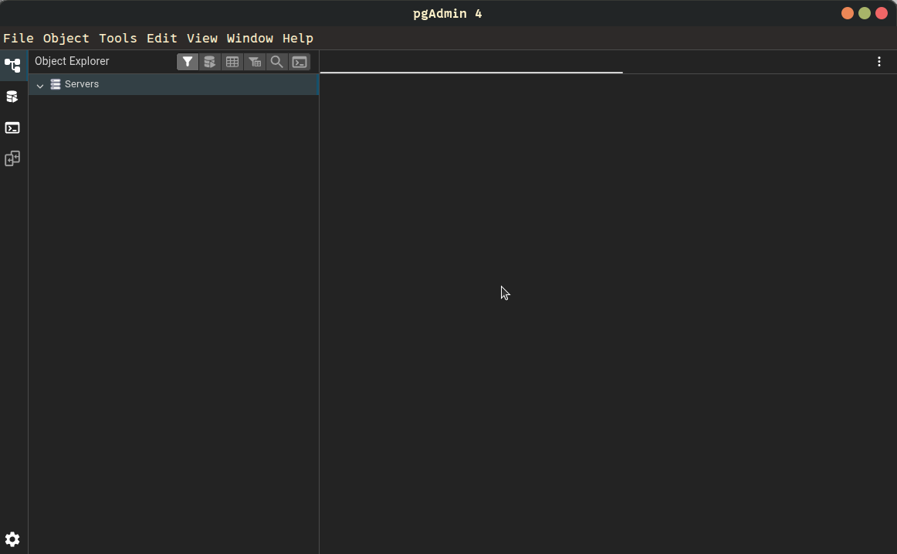
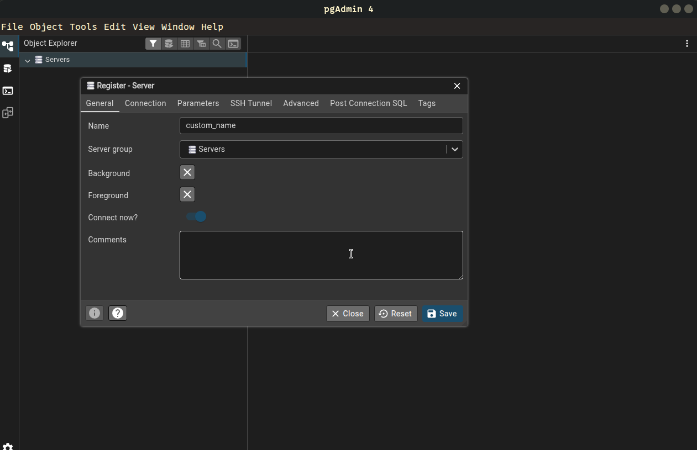
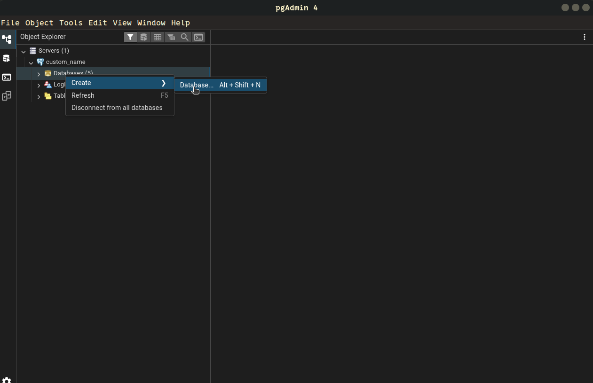
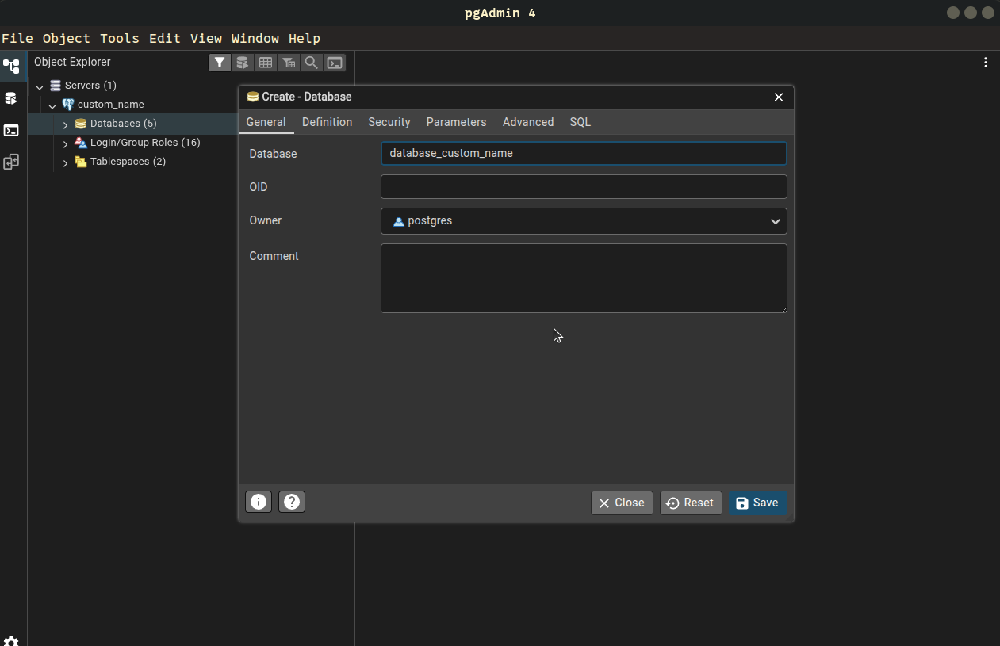
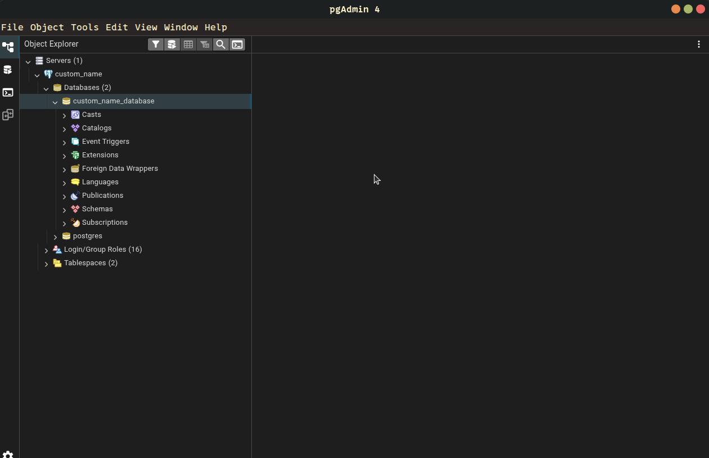

# Once you have launched pgAdmin 4 Follow the steps below to create the database

* Right click on `Servers`->`register`->`server`

---

* Choose the General Tab
* In the  **Name** field enter any name you desire for the database

---

* Choose the **Connection** Tab
* **Host name/address**:`localhost` 
* **Port**:`5432`
* **Maintenance Database**:`postgres`
* **Username**: `postgres`
* **Password** field, enter the password you set for the 
PostgreSQL `postgres` user.
* Finally click on **Save** button

---

* Now the new server should appear under The `Servers` .If not double click `Servers` to refresh 
* Then Right Click Your server `Create`->`Database`

---
* Go in **General** Tab if not already there
* In **Database** field enter the desired name of your database(custom)
* **Owner**: `postgres`
* Click `Save`

---
* Expand your `Server` with double click.
* Expand the `Databases`
* Your New Database should appear there.Click it once to select now you are ready to use it

